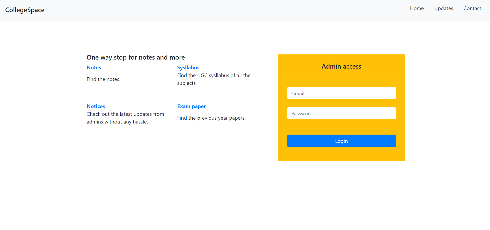
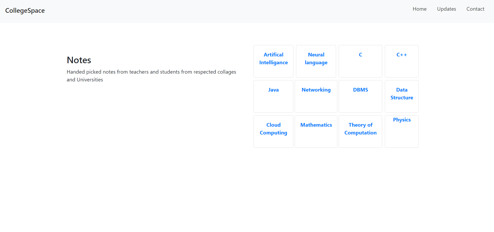
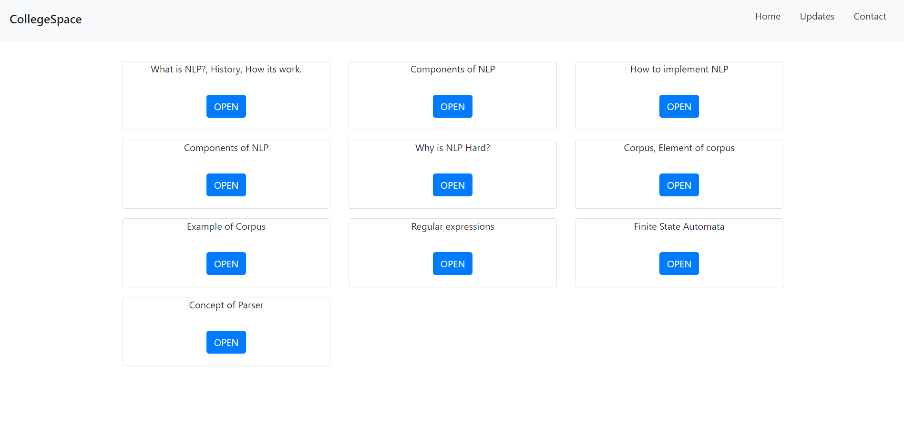
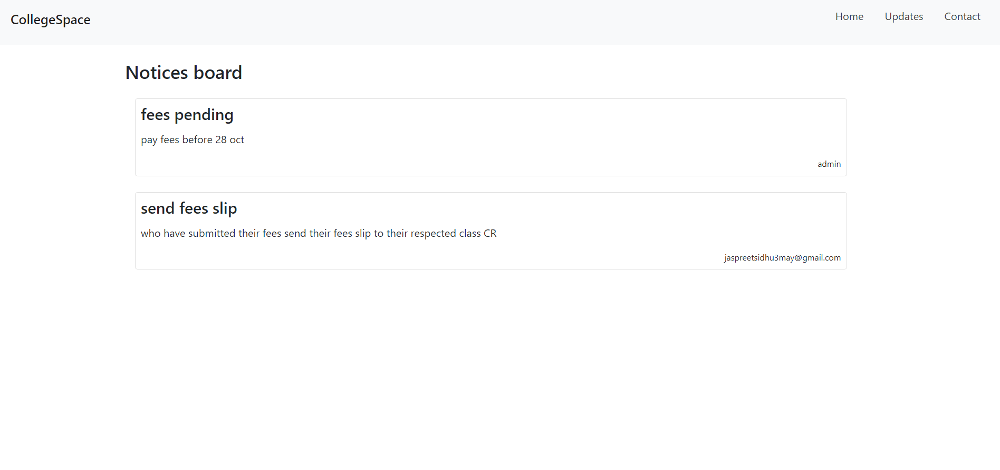
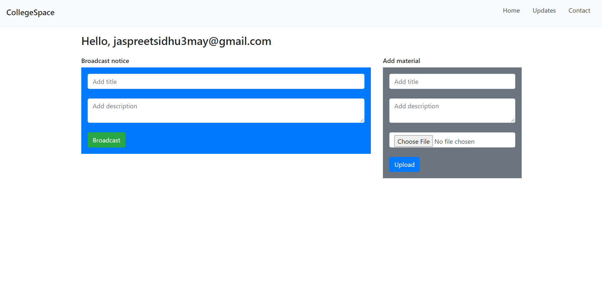

  
   
  </a>

  <h3 align="center">CollegeSpace</h3>

  

   Academic Portal with an aim to provide a holistic solution to all student needs.
   
  

## About The Project

CollegeSpace is the Academic Portal with an aim to provide a holistic solution to all student needs.

Why collegeSpace:
* Provide notes, sysllabus and previous year exams.
* Admin or teacher can broadcast their message, notice and notes.
* Top 3 contributers name will be listed on website

### Built With

* [Bootstrap](https://getbootstrap.com)
* [JQuery](https://jquery.com)
* [PHP](https://www.w3schools.com/php/DEFAULT.asp)
* [WAMP](https://www.wampserver.com/en/)

<!-- GETTING STARTED -->
## Getting Started

### Prerequisites
* For windows users
WAMP server or XAMPP server

* For mac users
XAMPP or DesktopServer

* For Linux users
XAMPP or LAMP server

### Installation

1. Clone the repo

2. Import sql database from sql_database in phpmyadmin in wamp server

3. Copy paste CollegeSpace folder to www folder in wamp folder (where you have installed wamp server)

4. You are now good to go.

<!-- USAGE EXAMPLES -->
## Screenshots

* Notes page

  
  

* Notices page

  

* Contact us page

  

* Admin page
  
  
  

<!-- CONTRIBUTING -->
## Contributing

Contributions are what make the open source community such an amazing place to be learn, inspire, and create. Any contributions you make are **greatly appreciated**.

1. Fork the Project
2. Create your Feature Branch 
3. Commit your Changes
4. Push to the Branch
5. Open a Pull Request

<!-- CONTACT -->
## Contact

Name - [Jaspreet Singh](https://www.linkedin.com/in/jaspreetsidhu13/) -  jaspreetsidhu3may@gmail.com

Project Link: [CollegeSpace](https://github.com/jaspreetsidhu3/collegespace)

<!-- ACKNOWLEDGEMENTS -->
## Acknowledgements
* [PHP](https://www.w3schools.com/php/DEFAULT.asp)
* [mySQL](https://www.mysql.com/)
* [Wamp](https://www.wampserver.com/en/)
* [JavaScript](https://www.w3schools.com/js/DEFAULT.asp)
* [JQuery](https://jquery.com/)
* [Bootstrap](https://getbootstrap.com/)
* <a href="https://icons8.com/icon/46855/student-center">Student Center icon by Icons8</a>

